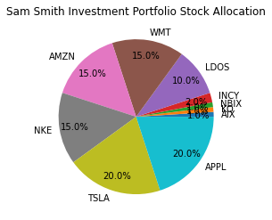
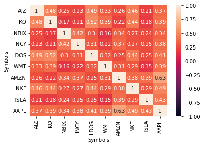
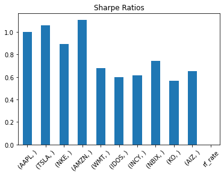
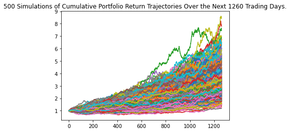
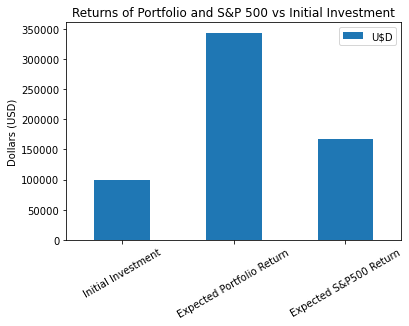
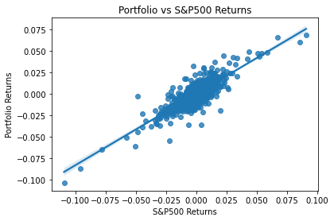

# A Whale of a Portfolio

    - Python File to open "portfolio_investment_analyser.ipynb".

## Create Portfolio

    

We have created a Financial Investment Analyser.  This tool analyses a number of risk scenarios to create a considered investment portfolio dependent on a number of client variables.    
 
We have drawn down our Finance data using the yFinance API.    
 
We have selected a a set of 10 tickers based on our own project risk analysis and assigned them as 
'high growth' or 'low vol'.  Stocks are as follows:   
 

    high growth:  AAPL, TSLA, NKE, AMZN, WMT   
    low vol: LDOS, INCY, NBIX, KO, AIZ   
 

Client variables are:   
    - age   
    - years to retirement   
    - the number of years they would like to invest for  
    - investment comfort level, levels are as follows:   

1. I do not want to lose my money, I would rather have a low return than risk the loss of any part of my capital.   
2. I prefer an amount of stablity, watching the market fluctuate makes me feel sick.   
3. I can accept a degree of market fluctation to achieve better results   
4. I am willing to accept moderate market fluctuations to achieve better returns.   
5. To receive the maximum return on my investment, I am willing to accept a higher investmemt fluctuations and a high degree of risk.   

Note: Option 1 is a stable investment strategy, and 5 has the highest risk, with the potential for higher returns.)   
 
Once we have this information we assign stock weights based on client's risk appetite.   
 
The output below is an example of the share investment weights for the client's seletced risk level appetite.   

We then represent the correlation of the stocks in the portfolio by using a heatmap from the Matplotlib.  The timeframe we have used is: '2018-01-01' to '2022-03-01'.

## Daily Returns, Sharpe Ratios, Risk

To calculate the daily returns, sharpe ratios and riks of the clients portfolio we firstly ask the client how much they would like to invest. 

We are using historical ticker data from yFinance and the risk_free_rate.csv data file which is sourced from our class activity 'Risky Business' to run the above calculations.  We are representing the results using the mplotlib as shown below.  We are representing the daily returns and risk in a dataframe.

# Monte Carlo simulation

We are using the Monte Carlo simulation to model risk of the clients portfolio.  

We will represent the following outcomes.

The expected return of your portfolio is 244.1 %.
The expected return of the S&P 500  is 67.80000000000001 %.
Your portfolio is expected to beat the S&P 500 by 176.227 %.
From your initial investment  of $100000, your total expected portfolio value is $344058.1022372034 therefore a gain of $244058.1022372034

Standard Deviation:
The expected standard deviation of your portfolio is 1.267
The expected standard deviation of the S&P 500  is 0.885
As your expected standard deviation is higher than the S&P 500 there is more volatility in your portfolio, hence there is more risk you are taking on.

Initial Investment Returns:

Current Standard Deviation:
Your current portfolio standard deviation is 0.01316
Current S&P 500 standard deviation is 0.01317
Currently, the S&P 500 is riskier than your portfolio

Beta against benchmark:

    
